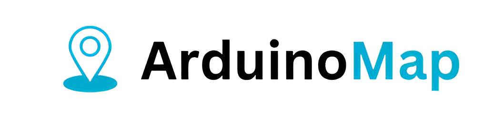

<hr></hr>

<h4 align="center">A free, open-source Arduino curriculum.</h4> 

<p align="center">
  <a href="https://visitorbadge.io/status?path=https%3A%2F%2Fgithub.com%2FVivanPanda%2Farduinomap"></a>
</p>

<p align="center">
  <a href="#about">About</a> •
  <a href="#installing">Installating</a> •
  <a href="#contributing">Contributing</a> •
  <a href="#authors">Authors</a> •
  <a href="#license">License</a>
</p>

## About

Yet to write.

## Installating

A step by step series of examples that tell you how to get a development env running

```
Give the example
```

## Contributing

Please read [CONTRIBUTING.md](https://gist.github.com/PurpleBooth/b24679402957c63ec426) for details on our code of conduct, and the process for submitting pull requests to us.

> And if you like the project, but just don't have time to contribute, that's fine. There are other easy ways to support the project and show your appreciation, which we would also be very happy about:
> - Star the project
> - Refer this project in your project's readme
> - Mention the project at local meetups and tell your friends

## Authors

Founded by [Vivan Panda](https://github.com/vivanpanda). See also the list of [contributors](https://github.com/vivanpanda/arduinomap/contributors) who participated in this project.

## License

This project is licensed under the MIT License - see the [LICENSE.md](LICENSE.md) file for details.
