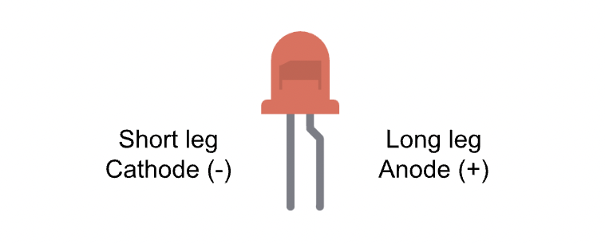

# Building Your First Circuit

## Understanding schematics

We must understand that there are two distinct representations of a circuit:

  

- **Schematic** - a blueprint of your circuit which uses symbols to represent components. 
- **Wiring diagram** - a wiring or breadboard diagram shows how to connect parts on a physical breadboard. 

:::info Remember
Engineers communicate using **schematics**, not wiring diagrams. 

Often, in tutorials, wiring diagrams are provided to help beginners easily construct circuits. However, following a wiring diagram is like following a LEGO kit. It gets the job done, but it doesn't teach you how the circuit works.  
:::

Since we will be using schematics frequently, it's essential that we understand how to work with them.

### Symbols

Read [this article by SparkFun Electronics](https://learn.sparkfun.com/tutorials/how-to-read-a-schematic) to familiarse yourself with the various schematic symbols. Don't worry about memorising all of them for now; you will slowly get used to them as you encounter more circuits. 

### Translating a schematic to the breadboard

The next step is to go from a schematic to an actual circuit on your breadboard. Remember to follow these steps when translating a schematic to a circuit:

1. Identify the components in your schematic and gather them. If you're struggling to remember what component a symbol represents, you can refer back to [this helpful guide.](https://www.rapidtables.com/electric/electrical_symbols.html)
2. Arrange the components on the breadboard neatly, making sure any polarized components are connected in the direction of current flow. 
3. Wire the connections using jumper wires. You can use the breadboard's side rails to connect to 5V and GND if you're powering many components.
4. Carefully double check your connections. Ensure components are not in the same row as this could result in a short circuit!
5. Begin programming!

This might seem complicated now, but it will make a lot more sense once we take a look at connecting the LED.

## The LED

A light emitting diode (LED) is a component that emits light when current passes through it. As the name implies, an LED is a diode, which means it only allows current to flow through it in one direction. [Watch this video](https://www.youtube.com/watch?v=9BDTtcRMxpA) if you want to understand how LEDs work.

LEDs can burn out if too much current passes through them. To prevent this from happening, we generally connect a current-limiting resistor in series with our LED to limit the amount of current flowing through it.

### LED polarity

LEDs are polarized components, which means they have designated positive and negative terminals. Polarized components must be connected in a specific direction to function correctly. If we do not connect a polarized component correctly, we risk causing damage to it. 

  

- The long leg, known as the **anode**, is the positive side of the LED. We usually connect this long leg to an Arduino digital pin or 5V.
- The short leg, known as the **cathode**, is the negative side of the LED. We usually connect this short leg to `GND`. 

Current always flows from the anode to the cathode, and never the opposite direction. 

### Constructing a simple LED circuit

Components required:
- 1x LED (any color of your choice)
- 1x 330Ω resistor
- Breadboard
- A handful of jumper wires
- Your Arduino Uno

admonition with two tabs one is try it yourself one is solution of making diagram breadboard from led. 

### Controlling the LED using code

  
## Assignment 

:::info Your Turn
1. Going forward, we will wire components without a wiring diagram. Get familiar with reading schematics and translating them into wiring diagrams through this video.
2. Remove all connections. Make an LED blink to morse code of your name. 
::: 

## Next Steps

This section includes links to help you dive deeper into the topics from this lesson. It's optional, so don't worry if you choose to skip it.

- 