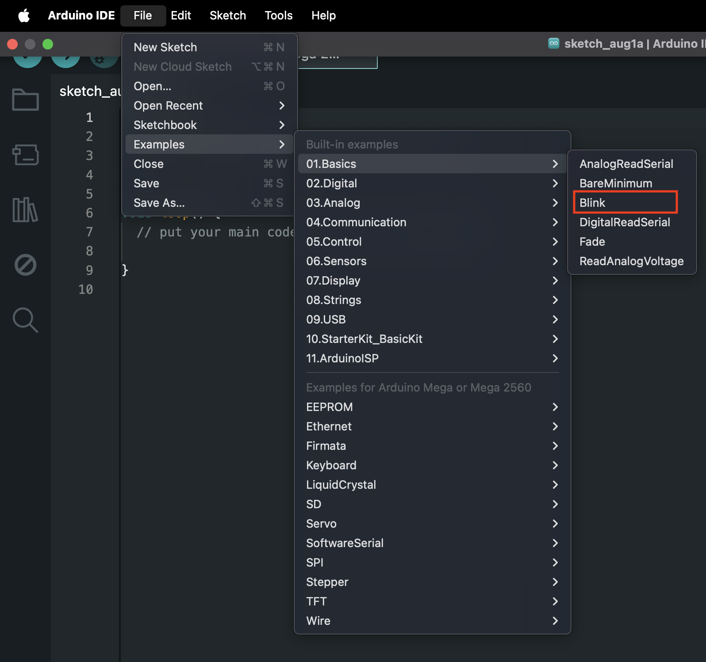
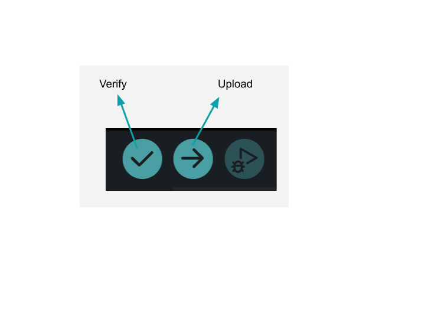

# Programming Basics

Our microcontroller cannot work by itself. Therefore, we need to communicate with our Arduino board using programmed instructions written in a variant of the `C++` programming language.

## Writing your first sketch

If you open a new sketch using the Arduino IDE, you will be faced with this boilerplate that contains two functions:

```cpp
void setup() {
  // put your setup code here, to run once:

}

void loop() {
  // put your main code here, to run repeatedly:

}
```

- `void setup()` - This function executes only once when the Arduino board is reset. You should program  configurations here that are intended to run **once**.
- `void loop()` - This function executes continuously, as `loop` implies. You should program tasks here that run repeatedly. For example, reading data from sensors.  

## Blinking the on-board LED

We will use an example sketch to blink the on-board LED on your Arduino microcontroller. From the menu, open the `Blink` example as shown below. 



You should be able to see this sketch:

```cpp
// the setup function runs once when you press reset or power the board
void setup() {
  // initialize digital pin LED_BUILTIN as an output.
  pinMode(LED_BUILTIN, OUTPUT);
}

// the loop function runs over and over again forever
void loop() {
  digitalWrite(LED_BUILTIN, HIGH);  // turn the LED on (HIGH is the voltage level)
  delay(1000);                      // wait for a second 
  digitalWrite(LED_BUILTIN, LOW);   // turn the LED off by making the voltage LOW
  delay(1000);                      // wait for a second
}
```

Now, plug in your Arduino board into your computer using the USB lead and select your microcontroller to establish a connection. 

<div class="img-center"> </div>
<br></br>
Notice you have two buttons in your IDE:
- `Verify` - Tells the IDE to check the code for syntax errors, compiles the sketch into machine code (binary), and reports any errors in the console.
- `Upload` - Performs the `Verify` step, followed by sending the binary code to the Arduino board. 

:::tip
The `Verify` tool can be useful to check your syntax for any errors without having to upload your sketch to your microcontroller. 
:::

Click on the `Upload` button to send your code over to your Arduino board. Once the sketch has been uploaded, you should see the yellow on-board LED start to blink. Congratulations!

## Variables

### Defining variables

```cpp
variable_datatype variable_name;
int myNum;
```

### Assigning a value to a variable

```cpp
variable_name = value;
myNum = 10;
```

[This article](https://learn.sparkfun.com/tutorials/data-types-in-arduino/defining-data-types) showcases some of the commonly used datatypes. 

## Comments

```cpp
// We can write comments using the two forward slashes
// Comments are ignored by the compiler and allow us to make our programs more maintable and easier to understand
```

## Operators

### Arithmetic operators

| Operator | Symbol | 
|---|---|
| Addition | `+` | 
| Subtraction | `-` | 
| Multiplication | `*` | 
| Division | `/` | 
| Remainder | `%` | 

### Comparison operators

| Operator | Symbol | 
|---|---|
| Greater than | `>` | 
| Less than | `<` | 
| Greater than or equal to | `>=` | 
| Less than or equal to | `<=` | 
| Equal to | `==` |
| Not equal to | `!=` |

### Logical operators

| Operator | Symbol | 
|---|---|
| OR | `\|\|` | 
| AND | `&&` | 
| NOT | `!` |   

## Assignment 

:::info Your Turn
1. Remember the `Blink` example sketch from earlier? Re-open it, but this time, change the `delay` to 500 milliseconds. Use a variable to store this delay time and ensure you have meaningful comments where applicable. If stuck, read the [documentation for the `delay()` function here](https://docs.arduino.cc/language-reference/en/functions/time/delay/). 
::: 

## Next Steps

This section includes links to help you dive deeper into the topics from this lesson. It's optional, so don't worry if you choose to skip it.

- Check out [this great summary video on data types for variables.](https://www.youtube.com/watch?v=vyxsg4Fc6Vg)