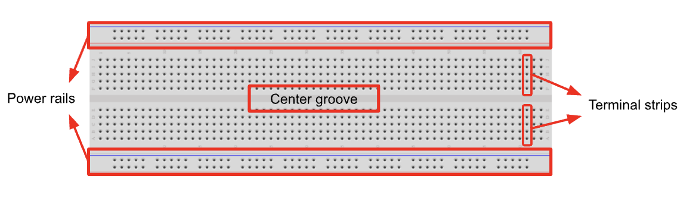
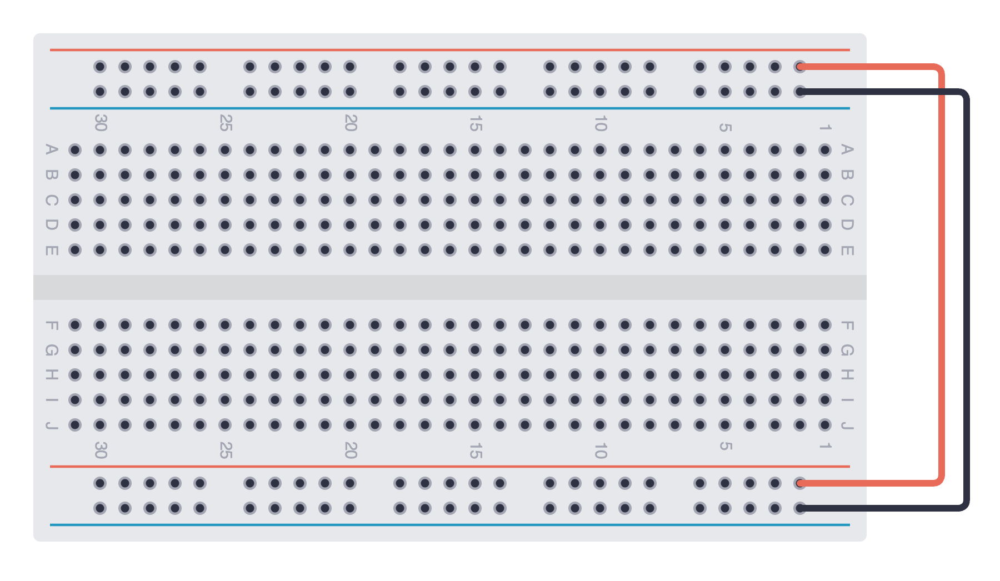

import Tabs from '@theme/Tabs';
import TabItem from '@theme/TabItem';
import LessonMeta from '@site/src/components/LessonMeta';

# Basic Electrical Skills

<LessonMeta {...frontMatter} />

Before we learn about connecting components to our Arduino, we need to be familiar with some basic electrical engineering concepts. 

## What is a circuit?

In electronics, a circuit is a path which allows  charge to flow from a power source and back to the source, hence completing the loop.

### Voltage, current and resistance 

But what is electricity? Electricity is the flow of electrical charge. The three basic principles of electricity - voltage (V or E), current (I), and resistance (R) - can be understood in reference to the charge. 
- **Voltage** refers to the difference in charge between two points. This is why voltage is commonly referred to as **potential difference**.
- **Current** is the rate of flow of charge.
- **Resistance** is a measure of opposition to the flow of charge. 

:::tip
The water analogy is an effective way to understand these concepts.
- Water flow represents current.
- Water pressure represents voltage.
- Any resistance to the flow of water represents resistance.

Watch [this video](https://www.youtube.com/watch?v=XrSdHjUtPYc) to grasp this concept.
:::

### Ohm's Law

Ohm's Law is a fundamental law in electricity which describes the relationship between voltage, current and resistance. This relationship can be expressed using the formula `V = IR`. 

## Understanding the breadboard

  

- **Terminal strips** are horizontal rows across the breadboard which are electrically connected. 
- **Power rails** are vertical columns that are found on the sides of the breadboard. The power rails allow us to have easy access to power and ground when building more complicated circuits. 
    - The rail marked with red lines represents positive connections.
    - The rail marked with blue/black lines represents ground connections.
- The **center groove**, or ravine, runs down the center of the breadboard, and allows us to easily fit components which have two rows of pins. 

:::tip 
We can connect the power rails on either side of the breadboard. Ensure you don't mix up the positive and negative rails!

  
:::

## Assignment 

:::info Your Turn
1. Watch [this video](https://www.youtube.com/watch?v=8jB6hDUqN0Y&t=204s) to understand Ohm's Law better.
::: 

## Next Steps

This section includes links to help you dive deeper into the topics from this lesson. It's optional, so don't worry if you choose to skip it.

- Check out [this video](https://www.youtube.com/watch?v=08YugQce9OA) to solidify these concepts. 
