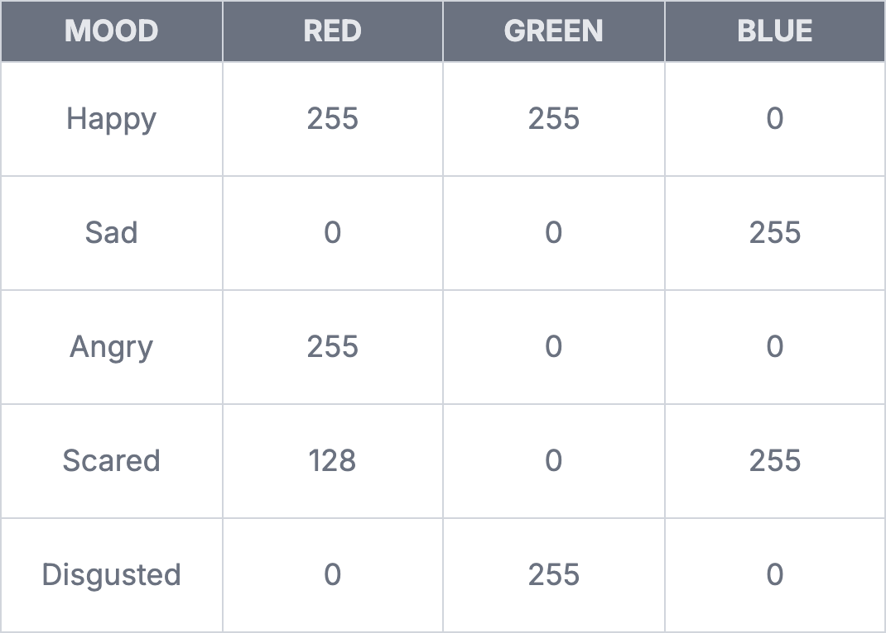

import Tabs from '@theme/Tabs';
import TabItem from '@theme/TabItem';

# The RGB LED

An RGB (Red-Green-Blue) LED is is like 3 LEDs in one. We can use an RGB LED to produce a variety of colors by mixing different intensities of red, green and blue light.

## How it works

An RGB LED has 4 pins - one for each color (R, G, B) and a common pin. The common pin is the longest pin on your RGB LED and goes to `GND` or `5V` depending on whether you have a common cathode or common anode RGB LED. 

We'll assume you're using a common cathode RGB LED for this lesson, and we'll connect the common pin to `GND`. If you have a common anode RGB LED, just connect the common pin to `5V` instead.

## Constructing your circuit

Components required:
- 1x RGB LED 
- 3x 220Ω resistor
- Breadboard
- Jumper wires
- Your Arduino Uno

:::info[Try it yourself]
<Tabs>
  <TabItem value="problem" label="Problem">
    Search up your RGB LED's datasheet online. Datasheets will be your friend when learning about new components since they provide all the necessary information you will need to construct your circuit. 
    
    <div class="img-center"></div>
    <br></br>

    Try building your circuit using the schematic above. Notice we have connected the red, green and blue legs of the LED to pins marked with a `~` on an Arduino. Do you remember why we use these pins?
  </TabItem>
  <TabItem value="solution" label="Solution">
    Below is the equivalent circuit diagram for this schematic. Did you hook up your components correctly?

    <div class="img-center"></div>
    <br></br>
  </TabItem>
</Tabs>
:::

## Programming your RGB LED

Now that you've wired up your RGB LED, it's time to program it to blink. Each color pin (R, G, B) behaves just like a regular LED, and you can turn it on and off by sending a `HIGH` or `LOW` signal. For example, the sketch below can be used to cycle through red, green and blue every second. 

```cpp
int redPin = 9;
int greenPin = 10;
int bluePin = 11;
 
void setup() {
  pinMode(redPin, OUTPUT);
  pinMode(greenPin, OUTPUT);
  pinMode(bluePin, OUTPUT);
}

void loop() {
  digitalWrite(redPin, HIGH);   // Red on
  digitalWrite(greenPin, LOW);
  digitalWrite(bluePin, LOW);
  delay(1000);

  digitalWrite(redPin, LOW);
  digitalWrite(greenPin, HIGH); // Green on
  digitalWrite(bluePin, LOW);
  delay(1000);

  digitalWrite(redPin, LOW);
  digitalWrite(greenPin, LOW);
  digitalWrite(bluePin, HIGH);  // Blue on
  delay(1000);
}
```

## Mixing colors

Alternatively, since we've connected our color pins to pins that support PWM, we can use these to send a PWM signal and vary the brightness of each color. This can then be used to mix colors. 

:::info[Try it yourself]
<Tabs>
  <TabItem value="problem" label="Problem">
    Pick your favorite color using [this RGB color picker](https://www.rapidtables.com/web/color/RGB_Color.html). Note down the R, G, B values and use the `analogWrite()` function to mix colors to obtain your favorite!
  </TabItem>
  <TabItem value="solution" label="Solution">
    This is an example sketch to display the color `Turquoise`. 
    ```cpp
    int redPin = 9;
    int greenPin = 10;
    int bluePin = 11;

    void setup() {
        pinMode(redPin, OUTPUT);
        pinMode(greenPin, OUTPUT);
        pinMode(bluePin, OUTPUT);
    }

    void loop() {
        analogWrite(redPin, 64);
        analogWrite(greenPin, 224);
        analogWrite(bluePin, 208);
    }
    ```
  </TabItem>
</Tabs>
:::

## Assignment 

:::info Your Turn
1. Write a program which prompts the user to enter a color through the serial monitor. Refer back to previous lessons if you're unsure on how to do this. Accept one of these color names: `red`, `green`, `blue`, `magenta`, `cyan`, `yellow`. Use `if...else...if` statements and the `analogWrite()` function to set an RGB LED to the correct color. Try constructing your circuit again to get some practice. Use the table below to get your R, G, B values:


::: 

2. What happens when you type in a color name like `MaGenTa`? Notice that you recieve an error, even though the spelling is correct. This is because the comparison is case-sensitive. To avoid this, we can convert the user's input to lowercase before comparing it using `if` statements. Read [this documentation](https://docs.arduino.cc/language-reference/en/variables/data-types/stringObject/Functions/toLowerCase/) and learn how to implement this on your own.

## Next Steps

This section includes links to help you dive deeper into the topics from this lesson. It's optional, so don't worry if you choose to skip it.

- Here is [a tutorial video on RGB LEDs](https://www.youtube.com/watch?v=iFPfg-x1qX8) you can watch.