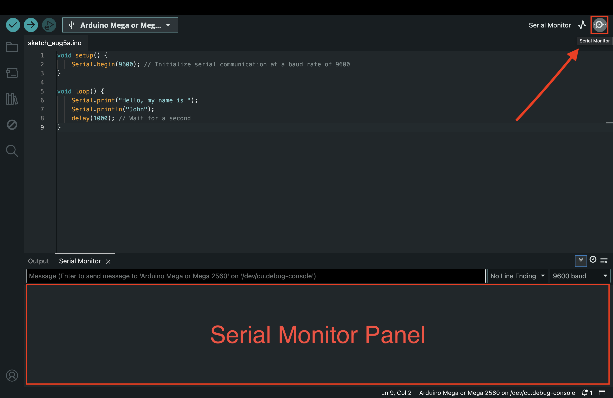

import Tabs from '@theme/Tabs';
import TabItem from '@theme/TabItem';
import LessonMeta from '@site/src/components/LessonMeta';

# The Serial Monitor

<LessonMeta {...frontMatter} />

The serial monitor is a tool within the Arduino IDE which we can use to communicate to and from the Arduino board. The serial monitor is especially useful when debugging and testing out different components to ensure they are functioning as expected. 

## Printing data to the serial monitor

To print data to the serial monitor, we need to first begin serial communication at a specified [baud rate](https://en.wikipedia.org/wiki/Baud). Some common baud rates we can initialize serial communication with include 9600 and 115200. 

We can then print data to the serial monitor using `Serial.print()` or `Serial.println()`.  For instance:

```cpp
void setup() {
    Serial.begin(9600); // Initialize serial communication at a baud rate of 9600
}

void loop() {
    Serial.print("Hello, my name is ");
    Serial.println("John"); 
    delay(1000); // Wait for a second
}
```

- [`Serial.begin()`](https://docs.arduino.cc/language-reference/en/functions/communication/serial/begin/) - sets the baud rate for serial transmission.
- [`Serial.print()`](https://docs.arduino.cc/language-reference/en/functions/communication/serial/print/) - prints data to the serial monitor without adding a new line at the end. 
- [`Serial.println()`](https://docs.arduino.cc/language-reference/en/functions/communication/serial/println/) - prints data to the serial monitor and then moves to the next line. 



We can open our serial monitor by clicking the magnifying glass icon in the top-right corner of the Arduino IDE. This has been  highlighted in the image above. Make sure that the baud rate in the serial monitor panel matches the one you have initialized in your code.

:::info[Try it yourself]
<Tabs>
  <TabItem value="problem" label="Problem">
    Write a simple Arduino program by creating an integer named `count` that starts at 0, prints it to the serial monitor, and increases the count by 1 each iteration. 

    Don't forget to use a delay to make sure it doesn't print too fast!
  </TabItem>
  <TabItem value="solution" label="Solution">
    ```cpp
        int count = 0;

        void setup() {
            Serial.begin(9600);
        }

        void loop() {
            Serial.println(count);
            count = count + 1;
            delay(500); // wait for half a second
        }
    ```
  </TabItem>
</Tabs>
:::

## Inputting data from the serial monitor

Now that we have learnt how to output data to the serial monitor, we should also learn how to input data from the serial monitor. To input from the serial monitor, we follow a three step process:

1. Prompt the user for input. We can use `Serial.print()` or `Serial.println()` to do so.

```cpp
Serial.println("Enter a number: ");
```

2. Wait for input using a `while` loop and the [`Serial.available()`](https://docs.arduino.cc/language-reference/en/functions/communication/serial/available/) function. The `Serial.available()` function returns the number of bytes available for reading from the serial port.

```cpp
while (Serial.available() == 0) {
    // Wait for input
}
```

Effectively, this helps to pause execution of the program until data is recieved from the user. 

3. Read and store input using functions like [`Serial.readString()`](https://docs.arduino.cc/language-reference/en/functions/communication/serial/readString/), [`Serial.parseInt()`](https://docs.arduino.cc/language-reference/en/functions/communication/serial/parseInt/) and [`Serial.parseFloat`](https://docs.arduino.cc/language-reference/en/functions/communication/serial/parseFloat/), depending on the input data type. We can then store the read data in a variable. For example:

```cpp
int myInput = Serial.parseInt();
```

:::tip Example
Inputting a username and greeting the user.

```cpp
void setup() {
  Serial.begin(9600);
}

void loop() {
  Serial.println("What is your name?"); // prompt

  // Wait until the user types something
  while (Serial.available() == 0) {
    // Do nothing
  }

  String userName = Serial.readString();

  Serial.print("Hello, ");
  Serial.print(userName);
  Serial.println("!");
  delay(2000); 
}
```
:::

## Assignment 

:::info Your Turn
1. Write a program to input how many times an LED should blink, and how fast the LED should blink using the serial monitor. Use this data to control how many times, and how fast an LED blinks. Refer back to a previous lesson if you're unsure on how to build a simple LED circuit. 
::: 

## Next Steps

This section includes links to help you dive deeper into the topics from this lesson. It's optional, so don't worry if you choose to skip it.

- Check out [this basic intro to the serial monitor](https://docs.arduino.cc/software/ide-v2/tutorials/ide-v2-serial-monitor/).
