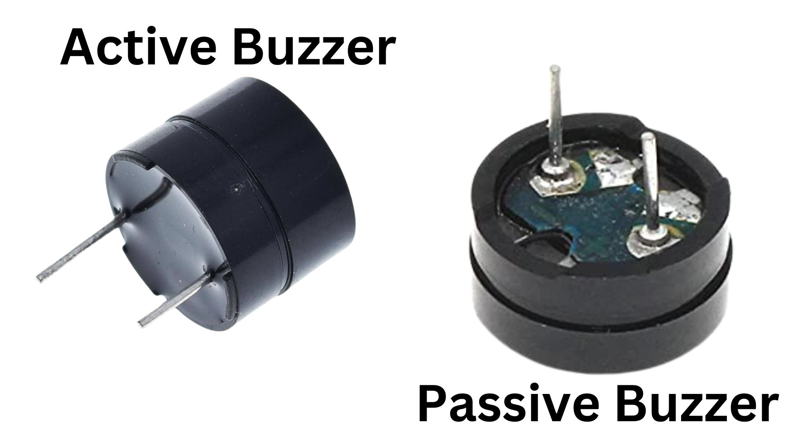
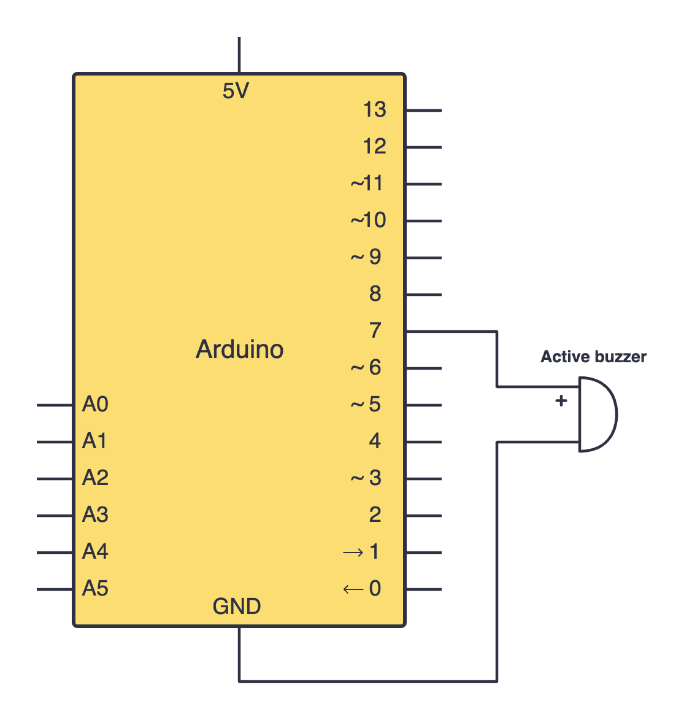
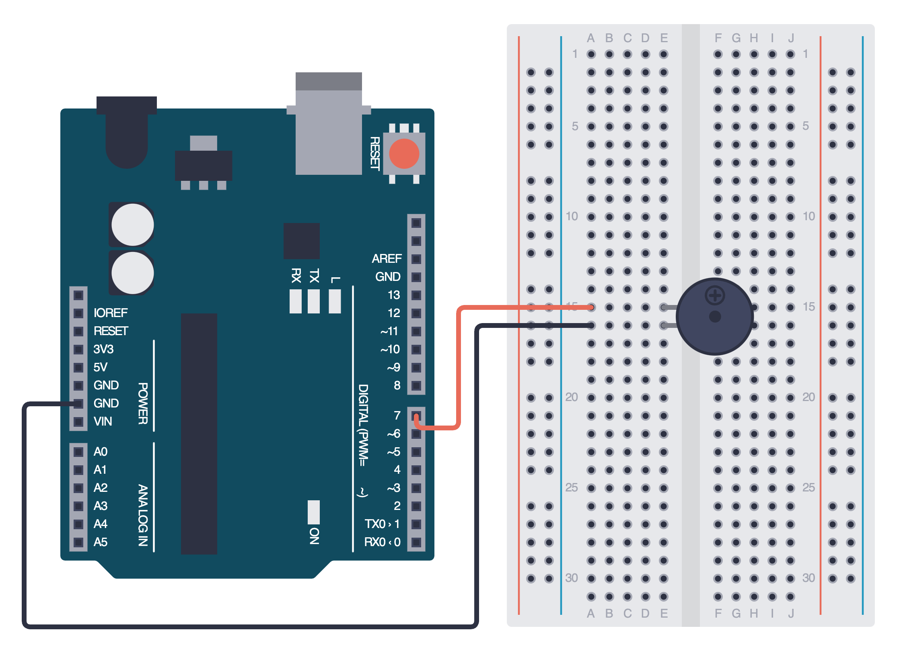

import Tabs from '@theme/Tabs';
import TabItem from '@theme/TabItem';

# Buzzers

Buzzers are an easy and effective way to bring in sound into your Arduino projects. We must understand that there are 2 different types of buzzers: active buzzers and passive buzzers. 

## Using active buzzers

Active buzzers are *active* because they require a DC voltage to produce souund. Passive buzzers, however, need an AC voltage to produce sound.

### Constructing your circuit

Components required:
- Active buzzer
- Your Arduino board
- Breadboard
- Jumper wires

:::info[Try it yourself]
<Tabs>
  <TabItem value="problem" label="Problem">
    Search up your active buzzer's datasheet online. Datasheets will be your friend when learning about new components since they provide all the necessary information you will need to construct your circuit. 

    Try building your circuit using this schematic:
    
    

      
  </TabItem>
  <TabItem value="solution" label="Solution">
    Below is the equivalent circuit diagram for this schematic. Did you hook up your components correctly?

    

      
  </TabItem>
</Tabs>
:::

### Programming your active buzzer

## Assignment 

:::info Your Turn
1. 
:::

## Next Steps

This section includes links to help you dive deeper into the topics from this lesson. It's optional, so don't worry if you choose to skip it.

- 