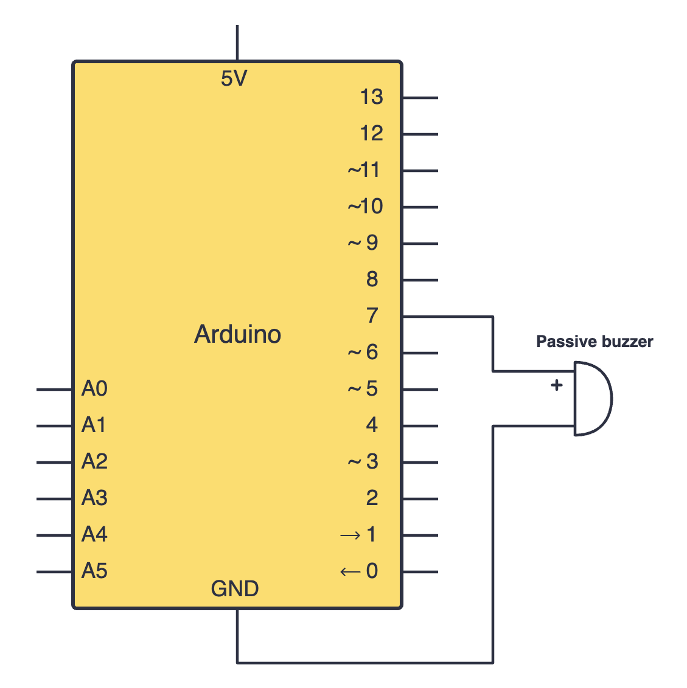

import Tabs from '@theme/Tabs';
import TabItem from '@theme/TabItem';

# Buzzers

Buzzers are an easy and effective way to bring in sound into your Arduino projects. We must understand that there are 2 different types of buzzers: active buzzers and passive buzzers. 

<div class="img-center"></div>

## Using active buzzers

Active buzzers are *active* because they require a DC voltage to produce souund. Passive buzzers, however, need an AC voltage to produce sound.

### Constructing your circuit

Components required:
- Active buzzer
- Your Arduino board
- Breadboard
- Jumper wires

:::info[Try it yourself]
<Tabs>
  <TabItem value="problem" label="Problem">
    Search up your active buzzer's datasheet online. Datasheets will be your friend when learning about new components since they provide all the necessary information you will need to construct your circuit. 

    Try building your circuit using this schematic:
    
    <div class="img-center"></div>
    <br></br>
  </TabItem>
  <TabItem value="solution" label="Solution">
    Below is the equivalent circuit diagram for this schematic. Did you hook up your components correctly?

    <div class="img-center"></div>
    <br></br>
  </TabItem>
</Tabs>
:::

### Programming your active buzzer

Active buzzers can be programmed in a similar way as LEDs using the `digitalWrite()` function.

```cpp
int buzzerPin = 7; // Active buzzer connected to pin 8

void setup() {
  pinMode(buzzerPin, OUTPUT);
}

void loop() {
  digitalWrite(buzzerPin, HIGH); // Turn buzzer ON
  delay(1000);                   // Wait 1 second
  digitalWrite(buzzerPin, LOW);  // Turn buzzer OFF
  delay(1000);                   // Wait 1 second
}
```

- `digitalWrite(buzzerPin, HIGH)` sends 5V to our buzzer, making it play a tone. This tone **cannot** be changed.

## Using passive buzzers

On the other hand, passive buzzers can be useful to play musical notes and produce tones. 

### Constructing your circuit

Components required:
- Passive buzzer
- Your Arduino board
- Breadboard
- Jumper wires

:::info[Try it yourself]
<Tabs>
  <TabItem value="problem" label="Problem">
    This time, search up your passive buzzer's datasheet online. Passive buzzers are connected in the same way as our active buzzers. Try building your circuit once more using this schematic:
    
    <div class="img-center"></div>
    <br></br>
  </TabItem>
  <TabItem value="solution" label="Solution">
    Below is the equivalent circuit diagram for this schematic. Did you hook up your components correctly?

    <div class="img-center"></div>
    <br></br>
  </TabItem>
</Tabs>
:::

### Programming your passive buzzer

To program a passive buzzer to make it play tones, we have to use the [`tone()`](https://docs.arduino.cc/language-reference/en/functions/advanced-io/tone/) function. The `tone()` function generates square waves which are sent to the passive buzzer to produce sound. By changing the `frequency`, we can change the pitch of the sound to generate new musical notes. 

We can use the `noTone()` function alongside this to turn off the `tone()` function. Let's look at this example sketch to understand how this works better:

```cpp
int buzzerPin = 7; // Passive buzzer connected to pin 7

void setup() {
  // No pinMode needed for tone() function
}

void loop() {
  tone(buzzerPin, 1000); // Play 1000Hz tone
  delay(1000);
  noTone(buzzerPin);     // Stop tone
  delay(1000);
}
```

## Assignment 

:::info Your Turn
1. The `tone()` function can be used to play melodies by generating musical notes at a specific frequency. Try playing around with different frequencies to create a simple, short melody that consists of 3-5 notes. You can use [this table](https://mixbutton.com/music-tools/frequency-and-pitch/music-note-to-frequency-chart#1st) to figure out which frequencies correspond to which notes.
:::

## Next Steps

This section includes links to help you dive deeper into the topics from this lesson. It's optional, so don't worry if you choose to skip it.

- [This article](https://www.engineersgarage.com/how-to-play-musical-notes-on-arduino/) covers how to use buzzers to play more complicated songs. 