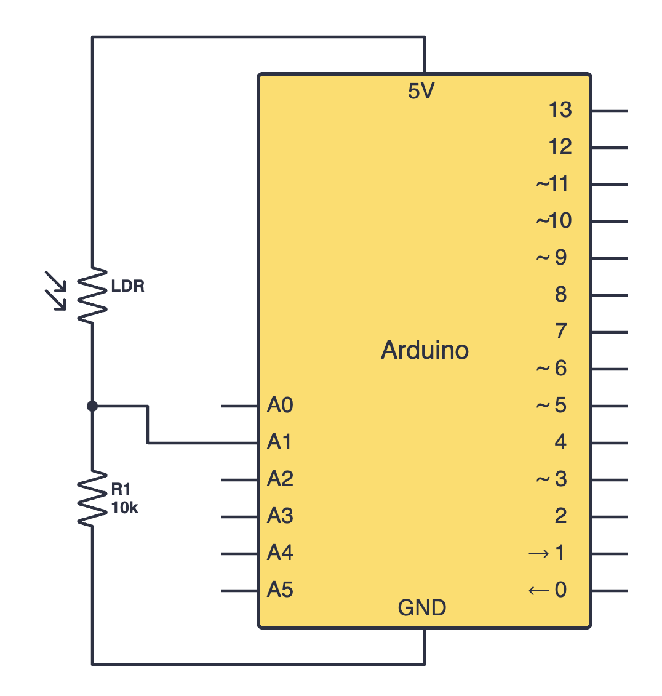
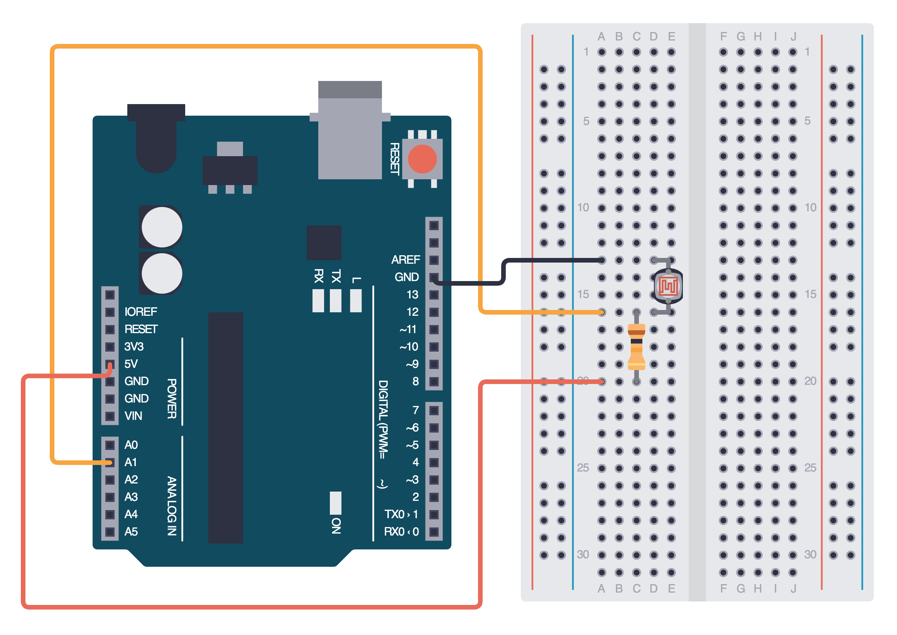

import Tabs from '@theme/Tabs';
import TabItem from '@theme/TabItem';
import LessonMeta from '@site/src/components/LessonMeta';

# The LDR

<LessonMeta {...frontMatter} />

The LDR, or photoresistor, is a light-sensitive resistor which can be used to measure light intensity and therefore build projects which detect light.

## How it works

An LDR's resistance decreases as the light intensity increases (when it's brighter), and hence the voltage increases. The opposite takes place when the light intensity decreases (when it's darker).  

Unfortunately, the Arduino cannot measure resistance directly. Instead, we have to measure voltage by constructing a voltage divider circuit. [Click here if you'd like to learn more about voltage divider circuits.](https://www.build-electronic-circuits.com/voltage-divider/) 

## Constructing your circuit

To construct our voltage divider circuit, we will connect an LDR in series with a 10k Ohm resistor. We will then read the voltage from the LDR by connecting the point between the LDR and the resistor to an analog pin.

Components required:
- 1x LDR (Photoresistor)
- 1x 10k Ohm resistor
- Your Arduino board
- Jumper wires
- Breadboard

:::info[Try it yourself]
<Tabs>
  <TabItem value="problem" label="Problem">
    Search up your LDR's datasheet online. Datasheets will be your friend when learning about new components since they provide all the necessary information you will need to construct your circuit. Try building your circuit using this schematic:
    
    <div class="img-center"></div>
    <br></br>
  </TabItem>
  <TabItem value="solution" label="Solution">
    Below is the equivalent circuit diagram for this schematic. Did you hook up your components correctly?

    <div class="img-center"></div>
    <br></br>
  </TabItem>
</Tabs>
:::

## Programming your LDR

To read this voltage, we will use the `analogRead()` function we learnt about earlier. If you recall, this function will return a value between 0 (0V) and 1023 (5V). Let's look at this sketch which reads the value and prints it to the serial monitor:

```cpp
int ldrPin = A1;

void setup() {
  Serial.begin(9600);
}

void loop() {
  int ldrValue = analogRead(ldrPin); // Use analogRead 
  Serial.println(ldrValue);
  delay(500);
}
```

Use this program to measure the values when the lights are on and off in your room. We will need this for this lesson's assignment. 

## Assignment 

:::info Your Turn
1. Now that you understand how an LDR works, construct a circuit with an LDR and an LED. Create a night light which turns an LED on when the light intensity in your room is too low. Use the values you recorded earlier to create thresholds:
    - If it gets too dark in your room (when the lights are off), turn the LED on. 
    - If it gets too bright in your room (when the lights are on), turn the LED off.
:::

## Next Steps

This section includes links to help you dive deeper into the topics from this lesson. It's optional, so don't worry if you choose to skip it.

- [This is another great tutorial on LDRs](https://projecthub.arduino.cc/electronicsfan123/interfacing-arduino-uno-with-ldr-61f455). Check it out if you want to consolidate your knowledge on photoresistors. 
