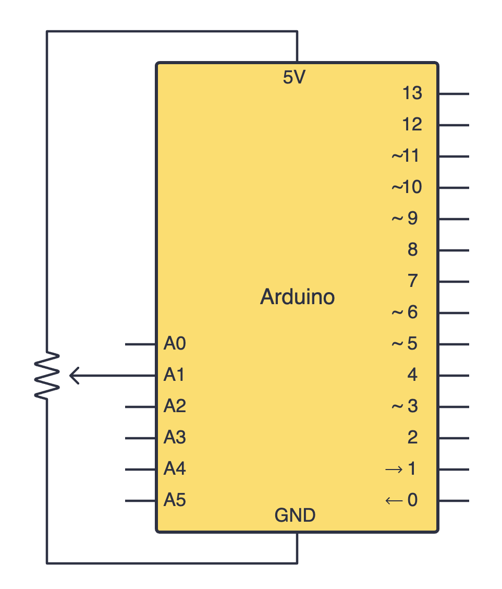

import Tabs from '@theme/Tabs';
import TabItem from '@theme/TabItem';
import LessonMeta from '@site/src/components/LessonMeta';

# Using Potentiometers

<LessonMeta {...frontMatter} />

A potentiometer is essentially a variable resistor, which means turning the knob changes its resistance, allowing us to control the output voltage. Potentiometers have 3 pins: two power supply pins (5V and GND), and one pin that connects an analog input pin on your Arduino board. 

## Constructing your circuit

Components required:
- 1x Potentiometer
- Breadboard
- Jumper wires
- Your Arduino Uno

:::info[Try it yourself]
<Tabs>
  <TabItem value="problem" label="Problem">
    Search up your potentiometer's datasheet online. Datasheets will be your friend when learning about new components since they provide all the necessary information you will need to construct your circuit. 
    
    <div class="img-center"></div>
    <br></br>

    Try building your circuit using the schematic above.
  </TabItem>
  <TabItem value="solution" label="Solution">
    Below is the equivalent circuit diagram for this schematic. Did you hook up your components correctly?

    <div class="img-center"></div>
    <br></br>
  </TabItem>
</Tabs>
:::

## Programming your potentiometer

Once you have connected your components in a circuit, let's work on programming our Arduino to read the potentiometer's position. To read the potentiometer's position, we use the [`analogRead()`](https://docs.arduino.cc/language-reference/en/functions/analog-io/analogRead/) function. This function reads the voltage at an analog pin (`A1`) and gives us a value between 0 and 1023 where:

- 0 refers to 0V (when the knob is all the way to one side)
- 1023 refers to 5V (when the knob is turned all the way to the other side)

Thankfully, we don't need to use the `pinMode()` function when working with an analog pin. Therefore, we can create a simple program to read and print the potentiometer's position to the serial monitor as shown below:

```cpp
int potVal; // will store the potentiometer's position value

void setup() {
  Serial.begin(9600);
}

void loop() {
  potVal = analogRead(A1); // stores the value into potVal
  Serial.println(potVal); // prints potVal out to the serial monitor
  delay(500); 
}
```

## `map()` 

Often, we need to use the [`map()`](https://docs.arduino.cc/language-reference/en/functions/math/map/) function when working with potentiometers. For instance, when controlling LED brightness using a potentiometer. 

The `map()` function allows us to scale a value from one range to another. For instance, when the value read using `analogRead()` is between 0 and 1023, and the value to be output to an LED using PWM is between 0 and 255. The function uses `y = mx + c`, so that you don't have to do the math yourself. This is how we can use the function in our sketches:

```cpp
map(value, fromLow, fromHigh, toLow, toHigh)
```

## Assignment 

:::info Your Turn
1. Use what you have learnt about potentiometers and the `map()` function to create a dimmable LED. Construct a circuit that uses a potentiometer, an LED and a current-limiting resistor. Then, write a program which reads the potentiometer value and maps it to a range that can be used with your LED. As you twist your potentiometer to the right, the LED should shine brighter. 
:::

## Next Steps

This section includes links to help you dive deeper into the topics from this lesson. It's optional, so don't worry if you choose to skip it.

- [This is a great watch to understand how to use potentiometers better.](https://www.youtube.com/watch?v=Wa8CjGsOFzY&pp=0gcJCfwAo7VqN5tD)
