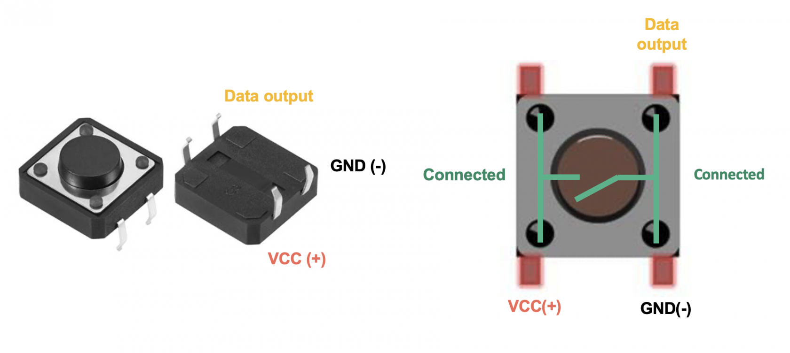
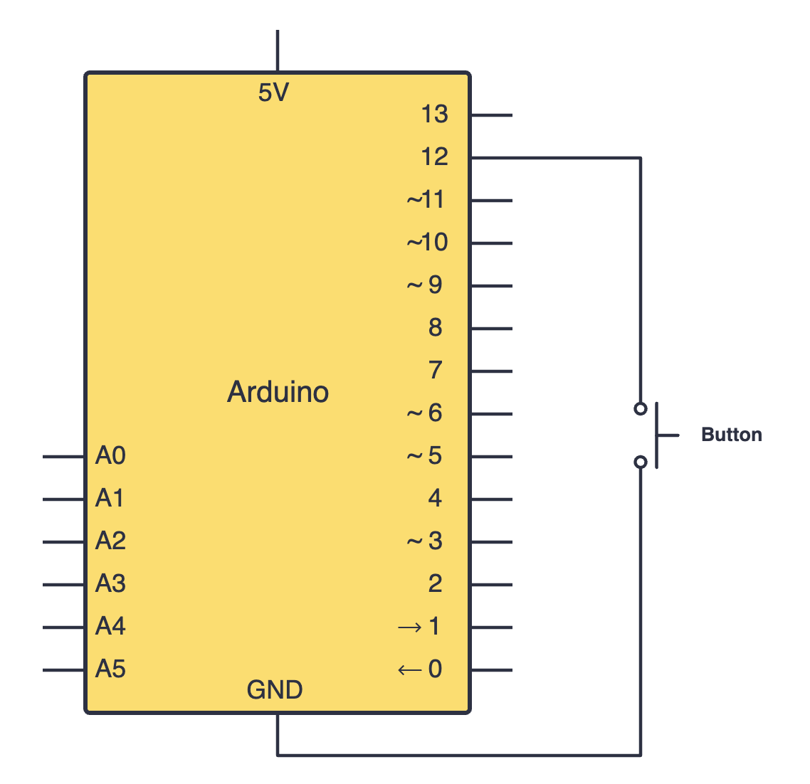
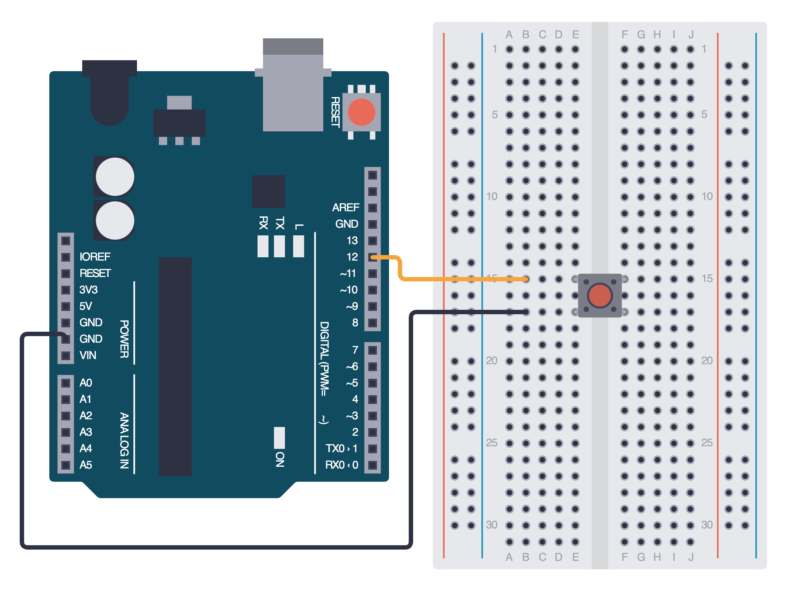

import Tabs from '@theme/Tabs';
import TabItem from '@theme/TabItem';
import LessonMeta from '@site/src/components/LessonMeta';

# Push Buttons

<LessonMeta {...frontMatter} />

A push button is a simple and handy component we can use to take user input into our projects. They work by completing a circuit when pressed, and opening (breaking) it when the button is released. They don’t have polarity, so they can be connected in either orientation.

## How it works

A push button consists of 4 pins - with 2 on either side being internally connected. When the button is pushed, the two sides are connected, allowing current to flow and complete the circuit. When the button is not pressed, these pairs of pins are not connected. 

<div class="img-center"></div>

### Pull-up and pull-down resistors

When we connect a push button to our Arduino board input pin, the input can be `floating`. This means that the microcontroller reads unpredictable values since it cannot decide firmly between HIGH and LOW. 

To go around this problem, we must use a pull-down or pull-up resistor:

- Pull-down resistors connect between the input pin and GND. 
    - When the button isn't pressed, the input reads `LOW` (0V), and when the button is pressed, the input reads `HIGH` (5V).
- Pull-up resistors connect between the input pin and 5V. 
    - When the button isn't pressed, the input reads `HIGH` (0V), and when the button is pressed, the input reads `LOW` (5V).

Luckily, Arduino's digital pins have in-built pull-up resistors which we can use without having to connect external resistors. To do this, we must set the `pinMode()` to `INPUT_PULLUP`.

```cpp
pinMode(buttonPin, INPUT_PULLUP);
```

## Constructing your circuit

Components required:
- 1x Push button
- Your Arduino board
- Breadboard
- Jumper wires

:::info[Try it yourself]
<Tabs>
  <TabItem value="problem" label="Problem">
    Search up your push button's datasheet online. Datasheets will be your friend when learning about new components since they provide all the necessary information you will need to construct your circuit. Try building your circuit using this schematic:
    
    <div class="img-center"></div>
    <br></br>
  </TabItem>
  <TabItem value="solution" label="Solution">
    Below is the equivalent circuit diagram for this schematic. Did you hook up your components correctly?

    <div class="img-center"></div>
    <br></br>
  </TabItem>
</Tabs>
:::

## Programming your push button

Once you've connected your push button using the schematic above, we will program it. To do this, we will use the [`digitalRead()`](https://docs.arduino.cc/language-reference/en/functions/digital-io/digitalread/) function and print a message to the serial monitor:

```cpp
int buttonPin = 12;  // Push button connected to pin 12
int buttonState;

void setup() {
  pinMode(buttonPin, INPUT_PULLUP);  // Enable internal pull-up resistor
  Serial.begin(9600);
}

void loop() {
  buttonState = digitalRead(buttonPin);
  if (buttonState == LOW) {
    Serial.println("Button Pressed");
  } else {
    Serial.println("Button Released");
  }
  delay(200);
}
```

## Assignment 

:::info Your Turn
1. Build a simple push button circuit in which an LED is on when the button is pressed, and off when the button is not pressed. 

:::tip Challenge
Try to create a *toggle* switch for turning this LED on and off. You can look for help online if stuck. 
:::

## Next Steps

This section includes links to help you dive deeper into the topics from this lesson. It's optional, so don't worry if you choose to skip it.

- Read [this](https://eepower.com/resistor-guide/resistor-applications/pull-up-resistor-pull-down-resistor/) to learn more about pull up and pull down resistors. 
