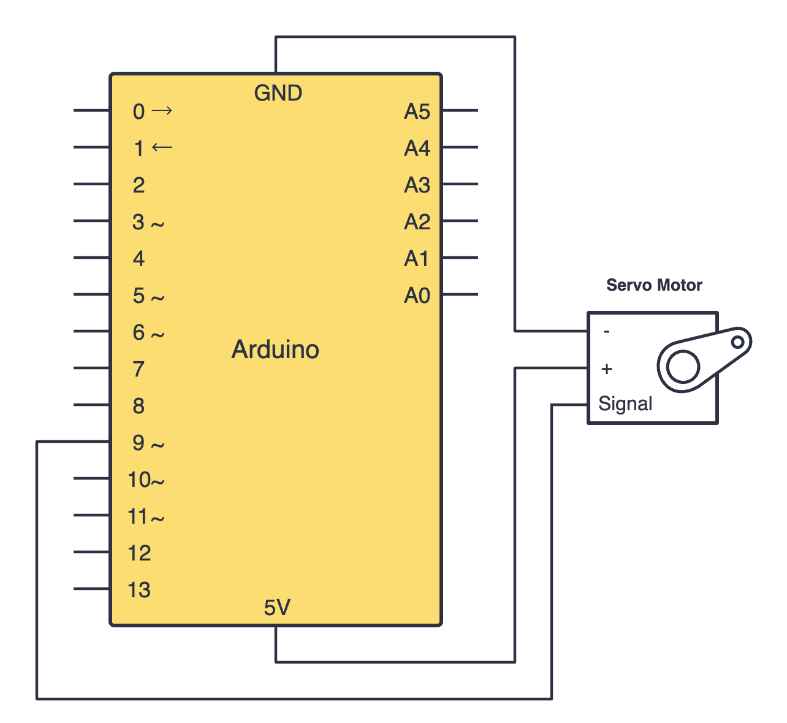
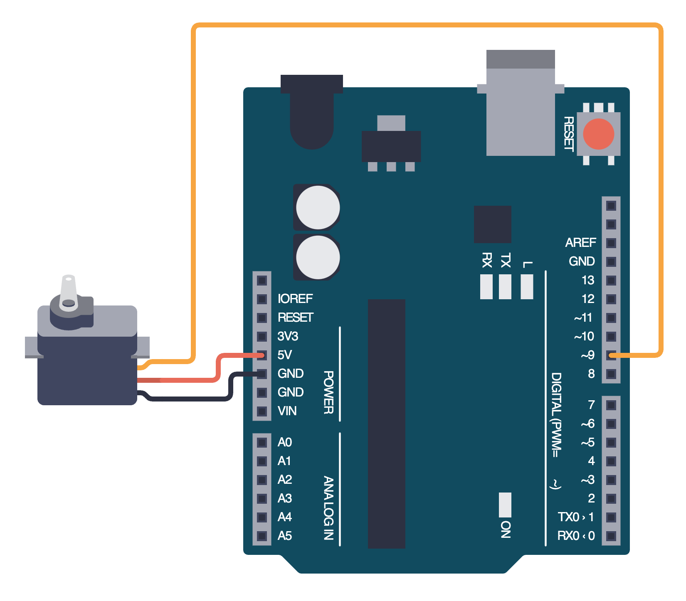

import Tabs from '@theme/Tabs';
import TabItem from '@theme/TabItem';

# Understanding Servo Motors

A servo motor is a type of motor which can be used to introduce motion into our projects. They allow us to produce precise movements and hence control the position of objects.

## How it works

Servo motors usually have an arm which can turn between 0 and 180 degress. We can program our servo using the Arduino IDE to make it turn to a specified angle. 

Servos are "all in one", which means they contain the motor, motor driver, etc all in one. This means that we do not need to connect additional hardware to them.

## Constructing your circuit

Components required:
- 1x 5V Servo motor
- Arduino board
- Jumper wires

:::info[Try it yourself]
<Tabs>
  <TabItem value="problem" label="Problem">
    Search up your servo motor's datasheet online. Datasheets will be your friend when learning about new components since they provide all the necessary information you will need to construct your circuit. Try building your circuit using this schematic:
    
    

      
  </TabItem>
  <TabItem value="solution" label="Solution">
    Below is the equivalent circuit diagram for this schematic. Did you hook up your components correctly?

    

      
  </TabItem>
</Tabs>
:::

## Programming your servo motor

### Including a library

## Assignment 

:::info Your Turn
1. 
:::

## Next Steps

This section includes links to help you dive deeper into the topics from this lesson. It's optional, so don't worry if you choose to skip it.

- 