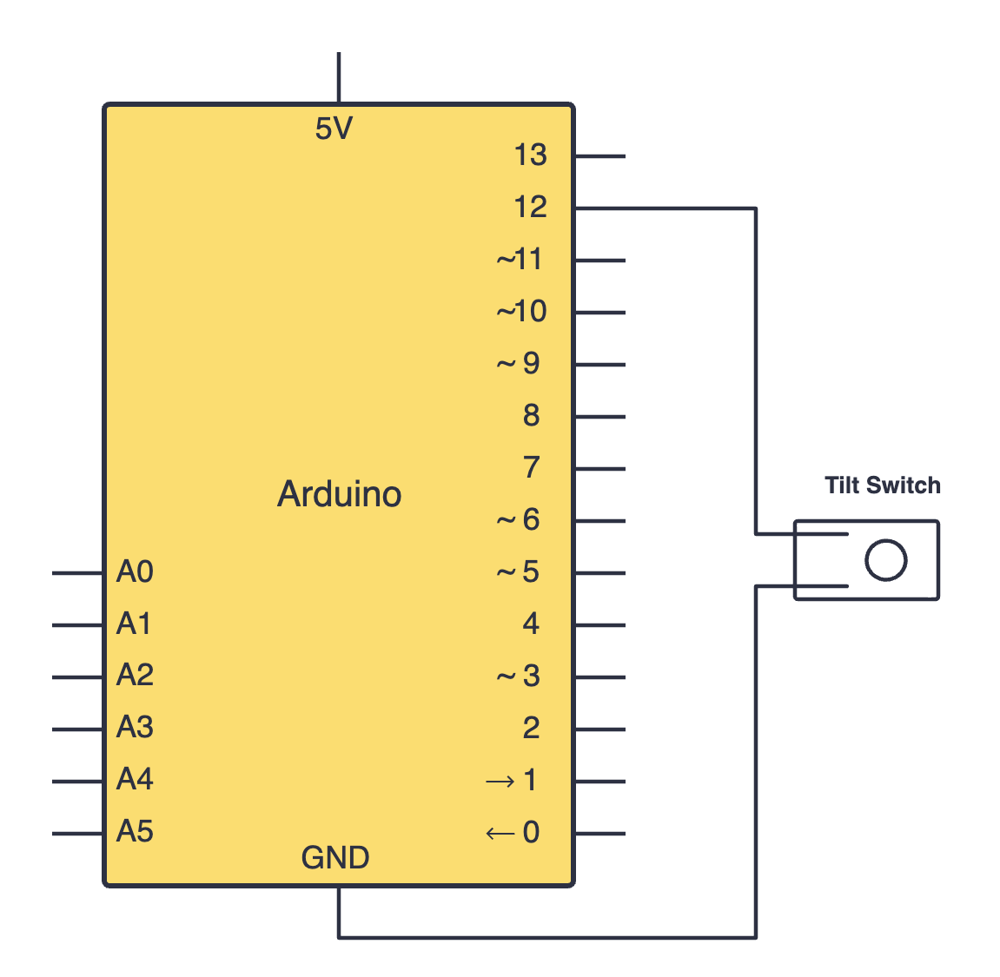
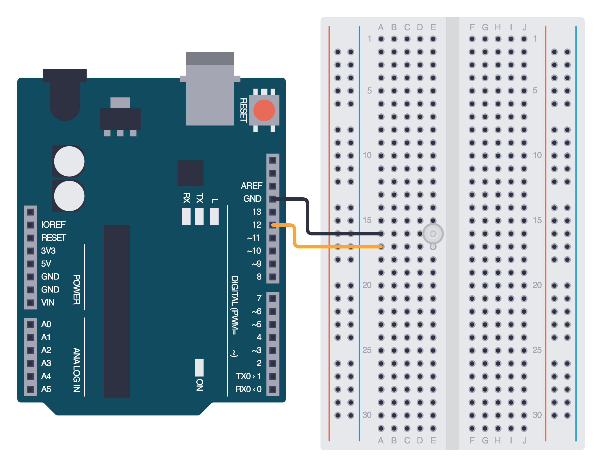

import Tabs from '@theme/Tabs';
import TabItem from '@theme/TabItem';

# Tilt Sensors

Tilt sensors, or tilt switches, are simple components that detect tilt or orientation. They are simpler to use as compared to accelerometers, which makes them a quick and easy addition to our Arduino projects.

## How it works

Tilt sensors usually have a tiny metal ball inside which moves around. When the sensor is level, the ball rests in a position where there is no connection between the internal contacts. When the sensor is tilted past a certain angle, the ball rolls and connects the contacts, closing the circuit.

This ON/OFF behavior lets the sensor act like a simple switch. 

## Constructing your circuit

Components required:
- 1x Tilt switch
- Breadboard
- Your Arduino board
- Jumper wires

:::info[Try it yourself]
<Tabs>
  <TabItem value="problem" label="Problem">
    Search up your tilt sensor's datasheet online. Datasheets will be your friend when learning about new components since they provide all the necessary information you will need to construct your circuit. Try building your circuit using this schematic:
    
    

      
  </TabItem>
  <TabItem value="solution" label="Solution">
    Below is the equivalent circuit diagram for this schematic. Did you hook up your components correctly?

    

      
  </TabItem>
</Tabs>
:::

## Programming your tilt sensor

## Assignment 

:::info Your Turn
1. 
:::

## Next Steps

This section includes links to help you dive deeper into the topics from this lesson. It's optional, so don't worry if you choose to skip it.

- 