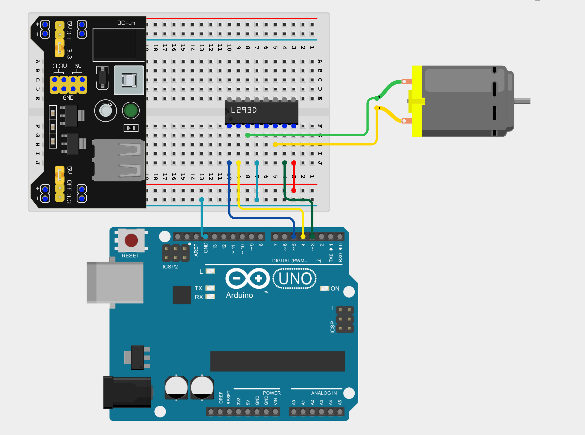

import Tabs from '@theme/Tabs';
import TabItem from '@theme/TabItem';

# DC Motors

The third type of motor we will learn about is the DC motor (direct current) motor. Unlike stepper motors, which move in precise steps, or servo motors, which move to specific angles, a DC motor can spin continously when powered. 

## How it works

A DC motor uses the motor effect from electromagnetism to convert electricity into mechanical energy (movement). It consists of two terminals; when current flows in one direction, the motor spins forwards, but when the current is reversed, the motor spins backwards. The speed of a DC motor depends on how much voltage is applied.

:::warning
Just like stepper motors, we cannot connect a DC motor directly to our Arduino board. Instead, we have to use a motor driver such as the `L298N` or `L293D` module and a power supply module.
:::

## Constructing your circuit

Components required:
- 1x DC Motor
- 1x External power supply - we will be working with a power supply module
- 1x L293D module (motor driver)
- Jumper wires
- Arduino board
- Breadboard

:::info[Try it yourself]
<Tabs>
  <TabItem value="problem" label="Problem">
    Search up your DC motor, motor driver and power supply module's  datasheet and pinout online. Try building your circuit using this pin layout:

    - DC motor connections to L293D
        - Motor terminal 1 → OUT1 (L293D pin 3)
        - Motor terminal 2 → OUT2 (L293D pin 6) 
    - L293D connections to Arduino
        - IN1 (pin 2) → Arduino D4
        - IN2 (pin 7) → Arduino D3
        - EN1 (pin 1) → Arduino D5 (PWM pin for speed)
        - GND (pins 4, 5) → Arduino GND
        - Vs (pin 8) → + from Power Module (9V–12V)
  </TabItem>
  <TabItem value="solution" label="Solution">
    Below is the equivalent circuit diagram for this schematic. Did you hook up your components correctly? 

    

      
    
    Notice we have only used  one side of the `L293D` motor driver chip. This is because the chip can control two DC motors at the same time, but we are only controlling one motoro for now. 
  </TabItem>
</Tabs>
:::

## Programming your blank

## Assignment 

:::info Your Turn
1. 
:::

## Next Steps

This section includes links to help you dive deeper into the topics from this lesson. It's optional, so don't worry if you choose to skip it.

- 