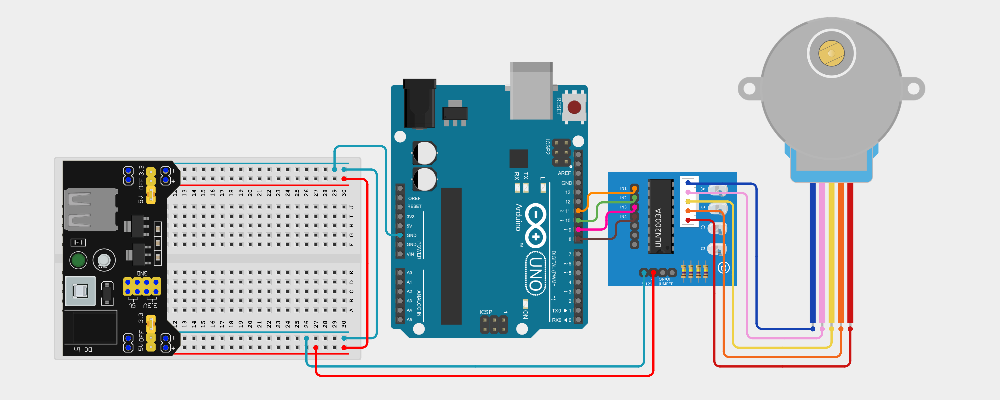

import Tabs from '@theme/Tabs';
import TabItem from '@theme/TabItem';

# Stepper Motors

Stepper motors can be used to produce motion in small *steps*. This allows us to program stepper motors to make very precise movements and this is why stepper motors are often used in 3D printers and robotic arms.

## How it works

A stepper motor works by converting electrical pulses into motion by using multiple coils. Unlike servo motors, a stepper motor cannot be connected directly to your Arduino board. This is because it requires more voltage that the Arduino can provide.

To avoid this, we have to use a motor driver module such as the `ULN2003` driver board. This driver allows us to construct our circuit with easy and provide power to our stepper motor. 

## Constructing your circuit

Components required:
- 1x Stepper motor eg. `28BYJ-48`
- 1x `ULN2003` driver module
- 1x External power supply - we will be working with a power supply module
- Breadboard
- Jumper wires (both male-male and female-male)
- Arduino board 

:::info[Try it yourself]
<Tabs>
  <TabItem value="problem" label="Problem">
    Search up your servo motor's datasheet and pinout online. Then, try to build your circuit on the breadboard. You can use this layout to help:

    - Connect your stepper motor to your motor driver
    - Motor driver (ULN2003) connections to Arduino
        - IN1 → Pin 11
        - IN2 → Pin 10
        - IN3 → Pin 9
        - IN4 → Pin 8
        - VCC → Breadboard 5V rail
        - GND → Breadboard GND rail
    - Connect your power supply module to your breadboard, ensuring that the positive and negative terminals are in line with your breadboard's power rails. 
  </TabItem>
  <TabItem value="solution" label="Solution">
    Below is the equivalent circuit diagram for this layout. Did you hook up your components correctly?

    <div class="img-center"></div>
    <br></br>
  </TabItem>
</Tabs>
:::

## Programming your stepper motor

As with the servo motor, to control and program our stepper motor, we have to interface with the Stepper library. We can include the library in our sketch using `#include <Stepper.h>` at the very top of our program.

A stepper motor moves in small increments. The `28BYJ-48` motor, when used with the `ULN2003` driver, typically needs 2048 steps to complete one full rotation.

```cpp
#define STEPS_PER_REV 2048
```

Also, we have to tell the Arduino which pins are connected to the driver’s inputs. The order of the pins matters — follow the sequence exactly as wired in the circuit section. 

```cpp
Stepper myStepper(STEPS_PER_REV, 11, 9, 10, 8);
```

We can then use the `setSpeed()` and the `step()` functions to make our stepper motor rotate. The completed example sketch is as follows:

```cpp
#include <Stepper.h>

#define STEPS_PER_REV 2048

Stepper myStepper(STEPS_PER_REV, 11, 9, 10, 8);

void setup() {
  myStepper.setSpeed(10); // 10 RPM
}

void loop() {
  myStepper.step(1024);  // Half rotation forward
  delay(1000);           // Wait 1 second
  myStepper.step(-1024); // Half rotation backward
  delay(1000);           // Wait 1 second
}
```

## Assignment 

:::info Your Turn
1. Connect a potentiometer to an analog input pin. Map the potentiometer value to a range between -2048 and 2048 steps using the `map()` function we learned about earlier. Move the stepper motor accordingly. 
:::

## Next Steps

This section includes links to help you dive deeper into the topics from this lesson. It's optional, so don't worry if you choose to skip it.

- [Read this to understand why we need a motor driver.](https://orbray.com/magazine_en/archives/3659)