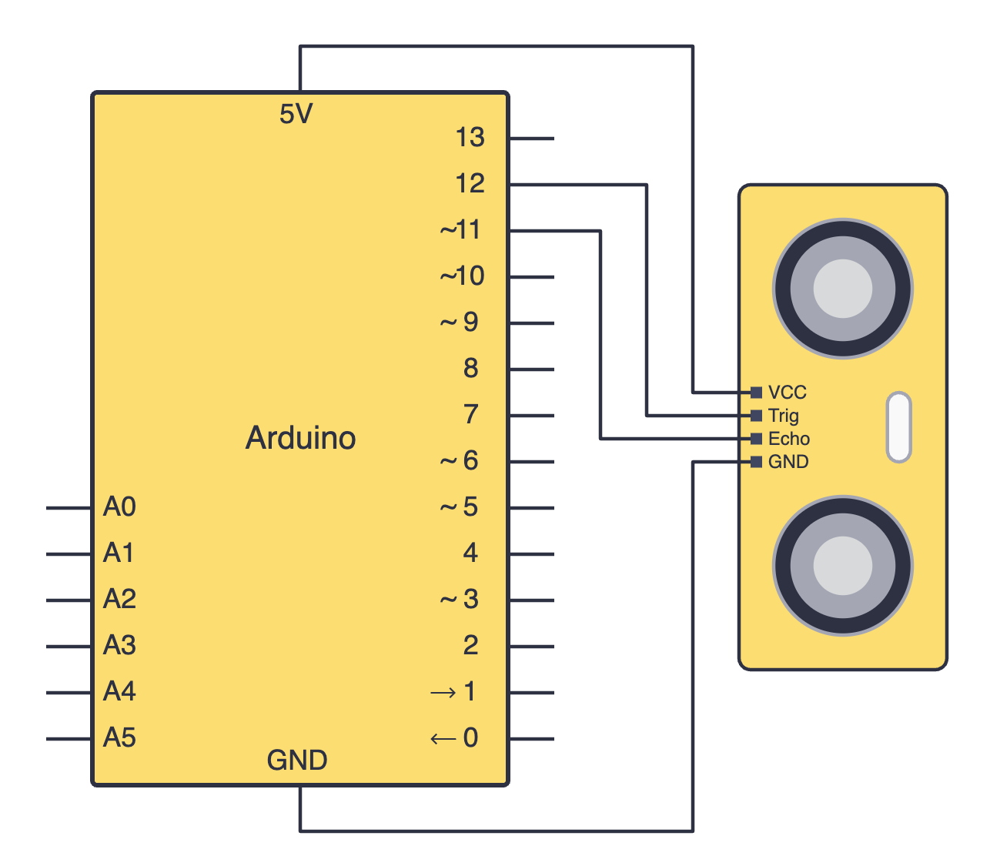
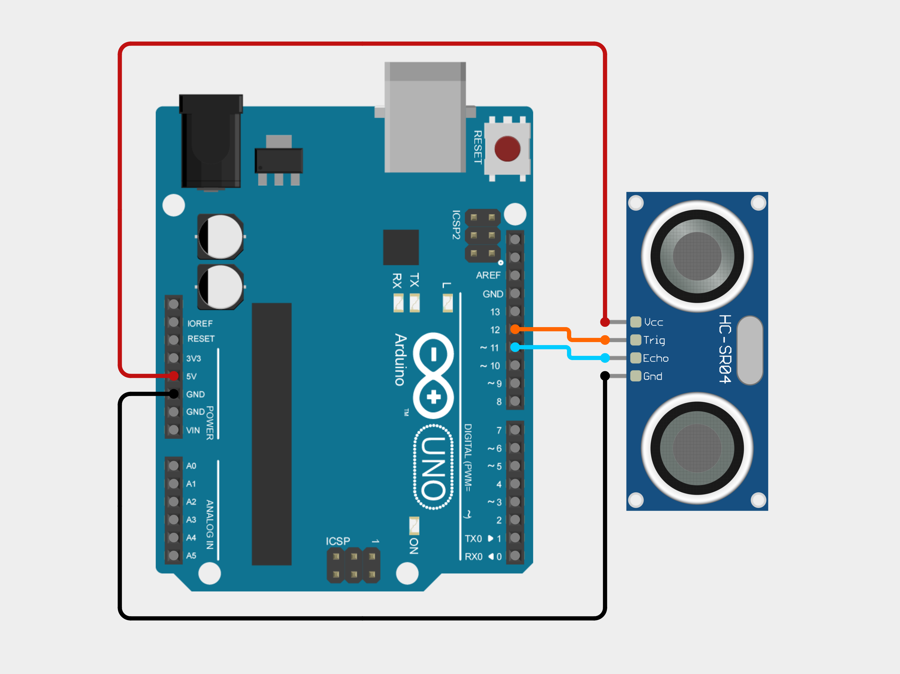

import Tabs from '@theme/Tabs';
import TabItem from '@theme/TabItem';

# Ultrasonic Sensors

An ultrasonic sensor is a distance sensor which can be used to create projects that measure distance, for example, in obstacle avoiding robots. 

## How it works

We will learn about using the `HC-SR04` ultrasonic sensor since it is relatively simple and straightforward to interface with. Since it is an *ultrasonic* sensor, the module works by sending a sound wave at ultrasonic frequency and waits for it to be reflected back. The time between the transmission of the wave and recieving of the wave is used to calculate the distance. 

- Trigger (Trig) pin → sends out a short ultrasonic “ping” (like sonar).
- Echo pin → listens for the reflection (bounce back) of that ping.

## Constructing your circuit

Components required:
- 1x `HC-SR04` ultrasonic sensor 
- Arduino board
- Jumper wires (female-male)

:::info[Try it yourself]
<Tabs>
  <TabItem value="problem" label="Problem">
    Search up your ultrasonic sensor's datasheet online. Datasheets will be your friend when learning about new components since they provide all the necessary information you will need to construct your circuit. Try building your circuit using this schematic:
    
    

      
  </TabItem>
  <TabItem value="solution" label="Solution">
    Below is the equivalent circuit diagram for this schematic. Did you hook up your components correctly?

    

      
  </TabItem>
</Tabs>
:::

## Programming your ultrasonic sensor

## Assignment 

:::info Your Turn
1. 
:::

## Next Steps

This section includes links to help you dive deeper into the topics from this lesson. It's optional, so don't worry if you choose to skip it.

- 